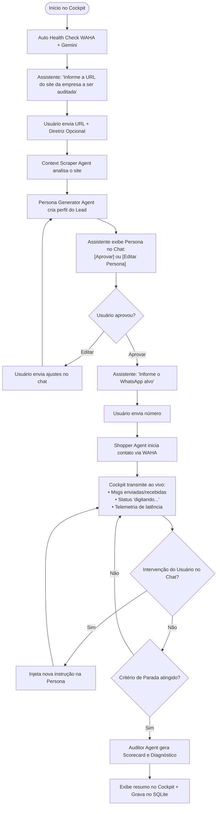

# Speed2Audit — Product Requirements Document (PRD)

**Version:** 0.1.0 (MVP)  
**License:** GNU AGPLv3  
**Execution Model:** Local-First / Open-Core  
**Primary Language/Runtime:** Python 3.12+  
**Repository:** `github.com/hugonotnice/speed2audit`

---

## 1. Executive Summary & Problem Statement

### 1.1 The Problem
Customer service and sales teams on WhatsApp often suffer from:
- Slow first-response times (Speed to Lead).
- Weak objection handling and failure to follow up.
- Friction or excessive delays in sending pricing, quotes, or scheduling consultation meetings.
- Lack of continuous, automated auditing to benchmark support quality and competitor response times.

### 1.2 The Solution
**Speed2Audit** is an open-core, local-first mystery shopping and auditing platform. It deploys autonomous, context-aware AI agents acting as prospective buyers on WhatsApp. The agent navigates the conversation naturally until reaching a terminal milestone (quote delivery, meeting booking, or checkout), while an evaluator agent benchmarks response latencies, answer quality, and objection handling.

---

## 2. System Architecture & Module Division

Speed2Audit is organized into three distinct, decoupled modules:

```
┌──────────────────────────────────────────────────────────────────────────────────┐
│                               SPEED2AUDIT PLATFORM                               │
├───────────────────────┬──────────────────────────┬───────────────────────────────┤
│  MÓDULO A             │  MÓDULO B                │  MÓDULO C                     │
│  Global Setup & Health│  O Cockpit (Chainlit)    │  Audit Reports & History      │
├───────────────────────┼──────────────────────────┼───────────────────────────────┤
│ • Auto Health Check   │ • Conversational Launch  │ • Independent Reports Screen  │
│ • WAHA Session Status │ • Site Scraper & ICP     │ • Multi-Session Filtering     │
│ • QR Code Connection  │ • Persona Gen + HITL     │ • Detailed Scorecards         │
│ • Gemini API Key Val. │ • Shopper Execution      │ • Commented Transcripts       │
│                       │ • Live Intervention      │ • Exportable Benchmarks       │
└───────────────────────┴──────────────────────────┴───────────────────────────────┘
```

---

## 3. Detailed Module Specifications

### 3.1 Módulo A: Global Setup & System Health Check
- **Auto-Verification on Startup:** Executed automatically when the application starts or when a session initiates.
- **Checklist Verified:**
  1. **WAHA Container:** Verifies if the WhatsApp HTTP API container is online (`http://localhost:3000/api/server/version`).
  2. **WhatsApp Session State:** Checks if the session is `WORKING` (logged in) or `SCAN_QR_CODE`. If not connected, displays the QR Code for pairing.
  3. **Google Gemini API Key:** Validates the presence and access of `GEMINI_API_KEY`.
  4. **SQLite Storage:** Ensures the local database (`speed2audit.db`) is initialized and writeable.

---

### 3.2 Módulo B: O Cockpit (Conversational Control Plane)
The Cockpit is built with **Chainlit** and provides a fully interactive, text-driven conversational UX for running audits with real-time feedback and Human-in-the-Loop (HITL) overrides.



#### Step-by-Step Flow:
1. **Target Discovery:** The agent asks for the target company's website URL and an optional custom directive (e.g., *"Insist on a 15% discount"* or *"Ask about migration from Tool X"*).
2. **Context Scraping:** The `Context Scraper Agent` reads the site and summarizes:
   - Core value proposition & products/services.
   - Ideal Customer Profile (ICP).
   - Expected pricing/consultation model.
3. **Persona Generation & Human-in-the-Loop (HITL):**
   - The `Persona Generator Agent` creates a tailored lead identity (Name, Role, Company Size, Budget, Specific Pain Point).
   - The Cockpit prompts the user to **Approve** or **Edit** the persona directly in the chat.
4. **Target Phone Binding:** The user provides the WhatsApp phone number (E.164 format).
5. **Mystery Shopper Execution:**
   - The `Shopper Agent` triggers the conversation via WAHA.
   - **Fixed Humanization Engine:** Non-configurable random delay between **15 and 40 seconds** before replying, followed by sending the WhatsApp `typing...` presence event through WAHA.
6. **Live Cockpit Streaming & Mid-Session Intervention:**
   - Real-time display of messages exchanged and latency timers.
   - If the user types instructions during the audit (e.g., *"Ask if they accept credit card"*), the Shopper Agent dynamically absorbs the directive in the next turn.
7. **Stop Conditions (Terminal States):**
   - **Success:**
     - Quote/pricing received (numerical price, pricing table, or PDF proposal).
     - Meeting/consultation link scheduled (Calendly, Google Meet, Zoom, or confirmed date/time).
     - Checkout link provided.
   - **Safety Turn Limit:** Maximum of **8 to 10 dialogue turns** to avoid infinite loops or token exhaustion.
   - **Abandonment / Timeout:** Target seller fails to reply within 120 minutes of inactivity.
   - **Explicit Disqualification:** Seller explicitly states they cannot service the request.

---

### 3.3 Módulo C: Audit Reports & History (Independent View)
A dedicated, clean reporting view focused on post-audit analysis:
- **Session Selector & Filtering:** Filter past audits by date, target company, WhatsApp number, or final score.
- **Executive Scorecard:**
  - **Speed Metrics:**
    - First Response Time (FRT / Speed to Lead).
    - Average Message Latency.
    - End-to-End Time to Quote / Time to Meeting.
  - **Quality Scores (0 to 10 Scale):**
    - Cordiality & Communication Clarity.
    - Objection Handling Capability.
    - Sales Proactivity & Closing Urgency.
- **Commented Transcript:** Full chronological dialogue with evaluator annotations highlighting sales mistakes, policy risks, or missed upsell opportunities.

---

## 4. Multi-Agent Engine Specifications

```
┌─────────────────────────────────────────────────────────────────────────────┐
│                          LANGGRAPH AGENT TOPOLOGY                           │
├───────────────────────────────┬─────────────────────────────────────────────┤
│ Agent Name                    │ Primary Responsibility                      │
├───────────────────────────────┼─────────────────────────────────────────────┤
│ 1. Context Scraper Agent      │ Crawls website, extracts offerings and ICP  │
│ 2. Persona Generator Agent    │ Creates realistic lead profile & pain point │
│ 3. Shopper Agent (WAHA)       │ Drives WhatsApp dialogue with human delays  │
│ 4. Auditor & Evaluator Agent  │ Evaluates transcripts and computes metrics  │
└───────────────────────────────┴─────────────────────────────────────────────┘
```

### 4.1 Humanization Engine (Fixed Rules)
- **Response Delay:** Uniform random distribution: $T_{\text{delay}} \in [15, 40] \text{ seconds}$.
- **Presence Simulation:** Send WAHA `startTyping` event $T_{\text{delay}} - 5\text{s}$ before sending the actual message payload, followed by `stopTyping`.
- **Channel Gateway:** All interactions occur strictly via **WAHA (WhatsApp HTTP API)** running in Docker, communicating over asynchronous HTTP (`httpx`). No official Cloud API dependency.

---

## 5. Technology Stack & Dependencies

| Component | Selected Technology | Rationale |
| :--- | :--- | :--- |
| **Language & Runtime** | Python 3.12+ | Modern typing, performance, and async support. |
| **Package Manager** | `uv` | Instant lockfile generation and PEP 621 compliance. |
| **Conversational UI** | `chainlit` | Instant conversational Cockpit, streaming, and native HITL. |
| **Agent Orchestrator** | `langgraph` | Cyclic state machine, turn management, and SQLite checkpoints. |
| **LLM Provider** | Google Gemini 2.0 Flash (`langchain-google-genai`) | Ultra-fast inference, high context window, low cost. |
| **WhatsApp Gateway** | `WAHA` (Docker) + `httpx` | Local-first, open-source WhatsApp HTTP bridge. |
| **Observability** | `arize-phoenix` | Local OpenTelemetry tracing for LangGraph nodes and latencies. |
| **Persistence** | `SQLite` (`sqlite3` / `langgraph-checkpoint-sqlite`) | Zero-config, single-file local storage (`speed2audit.db`). |

---

## 6. Core Data Models (Pydantic Schema)

```python
from datetime import datetime
from enum import Enum
from pydantic import BaseModel, Field

class AuditStatus(str, Enum):
    INITIALIZING = "INITIALIZING"
    SCRAPING = "SCRAPING"
    PERSONA_REVIEW = "PERSONA_REVIEW"
    AUDITING = "AUDITING"
    COMPLETED_SUCCESS = "COMPLETED_SUCCESS"
    COMPLETED_TIMEOUT = "COMPLETED_TIMEOUT"
    COMPLETED_LIMIT_REACHED = "COMPLETED_LIMIT_REACHED"
    FAILED = "FAILED"

class PersonaProfile(BaseModel):
    full_name: str
    company_name: str | None = None
    role: str
    core_pain_point: str
    budget_range: str | None = None
    urgency_level: str = "High"
    extra_instructions: str | None = None

class MessageRole(str, Enum):
    SHOPPER = "SHOPPER"
    TARGET_SELLER = "TARGET_SELLER"
    SYSTEM = "SYSTEM"

class ConversationTurn(BaseModel):
    turn_index: int
    role: MessageRole
    content: str
    timestamp: datetime = Field(default_factory=datetime.utcnow)
    latency_seconds_since_last: float | None = None

class Scorecard(BaseModel):
    first_response_time_seconds: float
    total_duration_seconds: float
    total_turns: int
    clarity_score: float = Field(ge=0, le=10)
    objection_handling_score: float = Field(ge=0, le=10)
    proactivity_score: float = Field(ge=0, le=10)
    executive_summary: str
    key_strengths: list[str]
    areas_for_improvement: list[str]

class AuditSession(BaseModel):
    session_id: str
    website_url: str
    target_phone: str
    status: AuditStatus
    persona: PersonaProfile | None = None
    created_at: datetime = Field(default_factory=datetime.utcnow)
    turns: list[ConversationTurn] = []
    scorecard: Scorecard | None = None
```

---

## 7. Definition of Done (MVP Acceptance Criteria)

1. [ ] **Módulo A Health Check:** App launches and validates WAHA connection + Gemini API key automatically.
2. [ ] **Módulo B Conversational Flow:** User provides URL $\rightarrow$ system scrapes site $\rightarrow$ generates persona $\rightarrow$ user approves in Chainlit $\rightarrow$ user provides phone $\rightarrow$ Shopper initiates WhatsApp chat.
3. [ ] **Humanization Rules:** Messages sent with 15–40s delay and `typing...` state sent via WAHA.
4. [ ] **Live Monitoring & Interventions:** Conversation turns stream in real time to Chainlit; user messages inject live steering directives.
5. [ ] **Stop & Scoring:** Session completes upon quote/meeting detection or safety limit; Evaluator generates Scorecard with FRT and quality ratings.
6. [ ] **Módulo C Reporting:** Finished audit is persisted to SQLite and reviewable with full transcript and scores.
