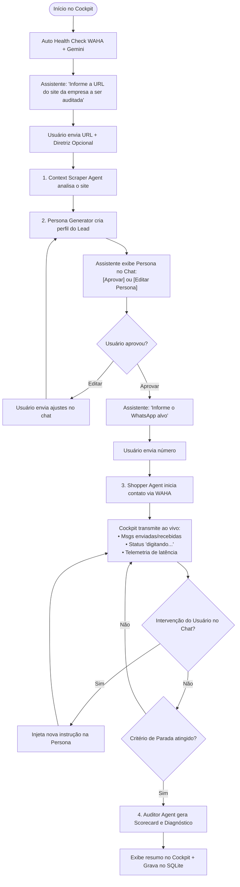

# Speed2Audit

[](LICENSE)
[](pyproject.toml)
[](https://langchain-ai.github.io/langgraph/)
[](https://chainlit.io/)

> **Open-Core Mystery Shopper & Auditing Platform for WhatsApp Customer Service & Sales Channels.**

---

## 🎯 Overview

**Speed2Audit** is a local-first, autonomous auditing platform that evaluates customer support and sales teams by acting as a realistic mystery shopper lead on WhatsApp.

It deploys a multi-agent team that analyzes target company websites, generates qualified personas, conducts multi-turn sales conversations, and scores the interaction across critical conversion metrics:

- ⏱️ **Speed to Lead (FRT)**: Measures initial response latency and ongoing conversational turnaround.
- 🎯 **Answer Quality & Clarity**: Evaluates product knowledge, communication clarity, and policy compliance.
- 🛡️ **Objection Handling**: Tests resilience when challenged with price objections, competitor comparisons, and custom friction points.
- 📑 **Quote & Meeting Velocity**: Benchmarks end-to-end turnaround time until a price quote, checkout link, or consultation meeting is secured.

---

## 🏛️ System Architecture

Speed2Audit is structured into **three decoupled modules**:

```
┌──────────────────────────────────────────────────────────────────────────────────┐
│                               SPEED2AUDIT PLATFORM                               │
├───────────────────────┬──────────────────────────┬───────────────────────────────┤
│  MÓDULO A             │  MÓDULO B                │  MÓDULO C                     │
│  Global Setup & Health│  O Cockpit (Chainlit)    │  Audit Reports & History      │
├───────────────────────┼──────────────────────────┼───────────────────────────────┤
│ • Auto Health Check   │ • Conversational Launch  │ • Dedicated Reports Dashboard │
│ • WAHA Session Status │ • Site Scraper & ICP     │ • Multi-Session Filtering     │
│ • QR Code Connection  │ • Persona Gen + HITL     │ • Detailed Scorecards         │
│ • Gemini API Key Val. │ • Shopper Execution      │ • Commented Transcripts       │
│                       │ • Live Intervention      │ • Exportable Benchmarks       │
└───────────────────────┴──────────────────────────┴───────────────────────────────┘
```

---

## 🤖 Multi-Agent Flow (LangGraph Topology)



### Specialized Agents:
1. **Context Scraper Agent**: Crawls target websites to extract product catalog, value propositions, and Ideal Customer Profile (ICP).
2. **Persona Generator Agent**: Generates hyper-realistic lead personas tailored to pass qualification filters.
3. **Shopper Agent**: Conduces the WhatsApp conversation via WAHA with fixed humanization delays (15–40s random delay + typing simulation).
4. **Auditor & Evaluator Agent**: Analyzes full transcripts, calculates latency benchmarks, and generates a multi-dimensional diagnostic scorecard (0–10 scale).

---

## 🛠️ Technology Stack

| Layer | Component | Description |
| :--- | :--- | :--- |
| **Runtime & Tooling** | Python 3.12+ / `uv` | High-performance async runtime and dependency resolution. |
| **Orchestration** | `langgraph` | Cyclic state machines with checkpoints and human-in-the-loop controls. |
| **Model Engine** | Google Gemini 2.0 Flash | Fast, low-latency reasoning via `langchain-google-genai`. |
| **Conversational UI** | `chainlit` | Native chat control plane, live streaming, and interactive action buttons. |
| **WhatsApp Gateway** | `WAHA` (Docker) + `httpx` | Self-hosted, local-first WhatsApp HTTP API bridge. |
| **Observability** | `arize-phoenix` | Local OpenTelemetry tracing for prompt chains and latency analysis. |
| **Database** | SQLite (`speed2audit.db`) | Local-first relational storage for audit runs, logs, and scorecards. |

---

## 🚦 Stop Conditions (Session Completion)

Auditing sessions terminate deterministically based on three conditions:
1. **Success**: Price quote/table received, consultation meeting booked (Calendly/Meet), or checkout link provided.
2. **Safety Turn Limit**: Maximum of 8 to 10 dialogue turns to prevent infinite loops.
3. **Abandonment**: Target seller fails to reply within 120 minutes of inactivity.

---

## 📂 Project Structure

```
.
├── PRD.md                    # Detailed Product Requirements Document
├── harness.md                # Development Macro-Phases & Constraints
├── GEMINI.md                 # Project Environment & AI Context
├── LICENSE                   # GNU AGPLv3 License
├── pyproject.toml            # Project metadata & build configuration
├── .env.example              # Environment variables template
└── src/
    └── speed2audit/
        ├── __init__.py       # Package entrypoint
        ├── config.py         # App configuration & settings
        ├── core/             # Data models & SQLite storage
        ├── agents/           # Scraper, Persona, Shopper, and Auditor agents
        ├── channels/         # WAHA (WhatsApp) HTTP client
        └── ui/               # Chainlit Cockpit & Reporting screens
```

---

## 📄 License

This project is open-source and licensed under the terms of the [GNU Affero General Public License v3.0 (AGPLv3)](LICENSE).
