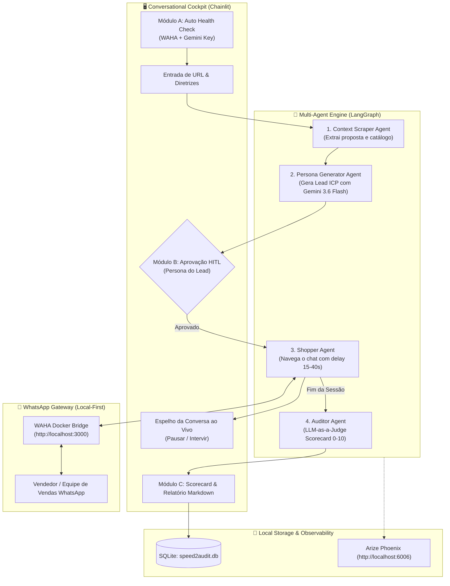

# 🕵️‍♂️ Speed2Audit

<p align="center">
  <strong>Autonomous Open-Core Mystery Shopper & Auditing Platform for WhatsApp Sales Channels</strong>
</p>

<p align="center">
  <a href="https://github.com/hugonotnice/speed2audit/actions/workflows/ci.yml"></a>
  <a href="LICENSE"></a>
  <a href="pyproject.toml"></a>
  <a href="https://ai.google.dev/"></a>
  <a href="https://langchain-ai.github.io/langgraph/"></a>
  <a href="https://astral.sh/ruff"></a>
  <a href="https://phoenix.arize.com/"></a>
</p>

---

## ⚡ What is Speed2Audit?

**Speed2Audit** is a local-first, privacy-respecting auditing platform that evaluates customer support and sales teams by deploying realistic, autonomous AI mystery shoppers directly into WhatsApp conversations.

It systematically benchmarks conversion readiness across 4 key vectors:
- ⏱️ **Speed to Lead (FRT):** Measures initial response latency and conversational turnaround.
- 🎯 **Answer Quality & Product Mastery:** Evaluates domain knowledge, clarity, and policy accuracy.
- 🛡️ **Objection Handling:** Tests seller resilience against pricing pushbacks, competitor comparisons, and customized friction points.
- 🏁 **Milestone Velocity:** Benchmarks turnaround time until quote delivery, meeting booking, or checkout link generation.

---

## 🚀 Quickstart (Under 2 Minutes)

### 1. Prerequisites
- Python `3.12+` or `3.13`
- [`uv`](https://github.com/astral-sh/uv) (Fast Python package manager)
- Docker (for local WAHA WhatsApp Gateway)

### 2. Clone & Install
```bash
git clone https://github.com/hugonotnice/speed2audit.git
cd speed2audit

# Install all dependencies instantly with uv
uv sync --all-groups
```

### 3. Setup Environment
```bash
cp .env.example .env
# Edit .env and paste your GEMINI_API_KEY
```

### 4. Start WhatsApp Gateway (WAHA)
```bash
docker run -d --name waha -p 3000:3000 devlikeapro/waha
```
> Scan the WhatsApp QR code at `http://localhost:3000/dashboard` to pair your auditing device.

### 5. Launch the Speed2Audit Cockpit
```bash
uv run chainlit run src/speed2audit/app.py -w
```
Open your browser at **`http://localhost:8000`** and start your first audit!

---

## 🎨 LangGraph Studio Visual Canvas

You can also run and inspect the multi-agent graph visually without Docker:

```bash
uv run langgraph dev
```

---

## 🏛️ System Architecture

Speed2Audit uses a modular, decoupled architecture powered by **LangGraph**, **Gemini 3.6 Flash**, and **Chainlit**:



---

## 📊 Scorecard & Benchmark Metrics

At the end of every audit run, Speed2Audit generates an exportable Markdown report with multi-dimensional scoring (0–10 scale):

| Dimension | Metric Analyzed | Target Benchmark |
| :--- | :--- | :--- |
| **Speed to Lead (FRT)** | Seconds until first seller response | `< 5 minutes` |
| **Product Knowledge** | Accuracy in answering pricing and product scope | `> 8.5 / 10` |
| **Objection Resilience** | Effectiveness when countering pricing & competition pushback | `> 8.0 / 10` |
| **Commercial Proactivity** | Driving next steps (booking meeting, sending quote link) | `> 9.0 / 10` |
| **Milestone Success** | Objective achieved (`QUOTE_RECEIVED`, `MEETING_SCHEDULED`, `ABANDONED`) | `SUCCESS` |

---

## 🛠️ Tech Stack & Philosophy

- **Local-First & Privacy:** Runs 100% on your own infrastructure. No conversational transcripts leave your machine.
- **Fast Reasoning Engine:** Powered by Google's latest **Gemini 3.6 Flash**.
- **Human-in-the-Loop:** Approve, edit, or steer persona profiles before and during conversations.
- **Humanization Delay:** Emulates real customer behavior with fixed random **15–40s delays** and typing presence indicators.

---

## 🧪 Development & Testing

```bash
# Run full automated test suite (27 tests)
uv run pytest

# Check code formatting with Ruff
uv run ruff check
uv run ruff format --check
```

---

## 🤝 Contributing

Contributions are warmly welcome! Please read [`CONTRIBUTING.md`](CONTRIBUTING.md) and [`CODE_OF_CONDUCT.md`](CODE_OF_CONDUCT.md) before submitting pull requests.

---

## ⚖️ License

Speed2Audit is open-source software licensed under the **[GNU Affero General Public License v3.0 (AGPLv3)](LICENSE)**.
